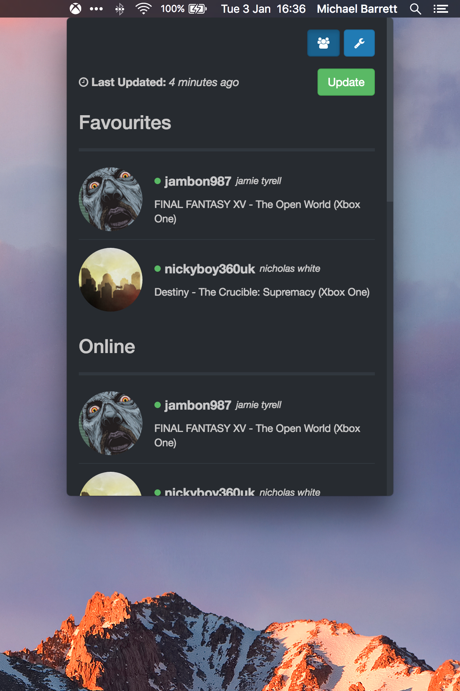

#### ⚠️ This project is no longer maintained

#  XBL Friends

A menu bar application to see when your Xbox live friends are online.

Download the latest version [here](https://github.com/mike182uk/xbl-friends/releases).

## Features

- See which of your friends are online and what they are playing
- Receive a native desktop notification when a friend comes online
- Configure the notification preferences so that you only get a notification when a favourite friend comes online, or if you don't want notifications at all, you can turn them off.

  

## How does this work?

XBL Friends is an [electron](http://electron.atom.io) app that uses the Xbox Live website to retrieve your friends list. Microsoft does not provide an open Xbox Live API so XBL Friends has to use a different method to retrieve your friends list: scrape your Xbox Live account homepage (the page you see when you log in to the Xbox Live website).

When you first run the app, you will be asked to login to your Xbox Live account. A new window will be opened where you will follow the normal Microsoft account auth flow. Once are authorised, this window will be hidden but kept alive in the background. XBL Friends will then use this hidden window to scrape the data needed. The window will be refreshed periodically to retrieve new data.

If you are keen to know more on the inner workings, take a peek at the source or ping me on here or [twitter](https://twitter.com/mike182uk).

## FAQ's

### How do i quit the app?

Right click on the menu bar icon and select **Quit**.

### Why am i redirected to the Xbox Live login page when i click on a friends name?

To view a friends profile, you will need to be logged into your Xbox Live account. As the page is opened outside of the XBL Friends app, it is possible that you may have to login again if you are not already logged in on your system browser.

### macOS only?

Currently only macOS builds are uploaded to the GitHub releases page.

XBL friends should run on any platform that electron supports, so if you are not a macOS user, you can clone this repo and with a few config changes, build the project for your system (see [CONTRIBUTING.md](CONTRIBUTING.md) for details on building the project).

Feel free to open an issue if you have a problem building the project on your system.

### Will the app break if Microsoft update the HTML for the account home page?

Yep 😞

The app would need patching to work with the updated HTML. In this situation, XBL Friends would report that you have no friends.

### Is this app safe to use?

I would advise only using the app if it was downloaded from the GitHub releases page for this project or via some other source that uses GitHub releases (i.e homebrew).

XBL Friends does not do anything nefarious with your Xbox Live account details (they are not saved by the app etc). When you log in to your Xbox Live account, you are talking directly to Microsoft. XBL Friends uses the authenticated window to retrieve its data.
